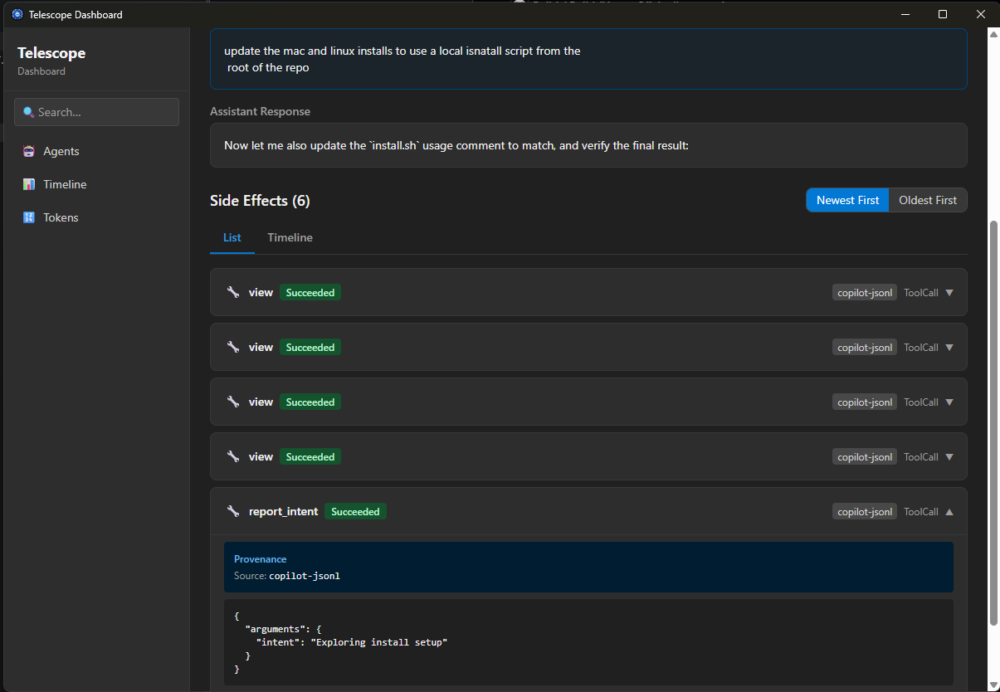
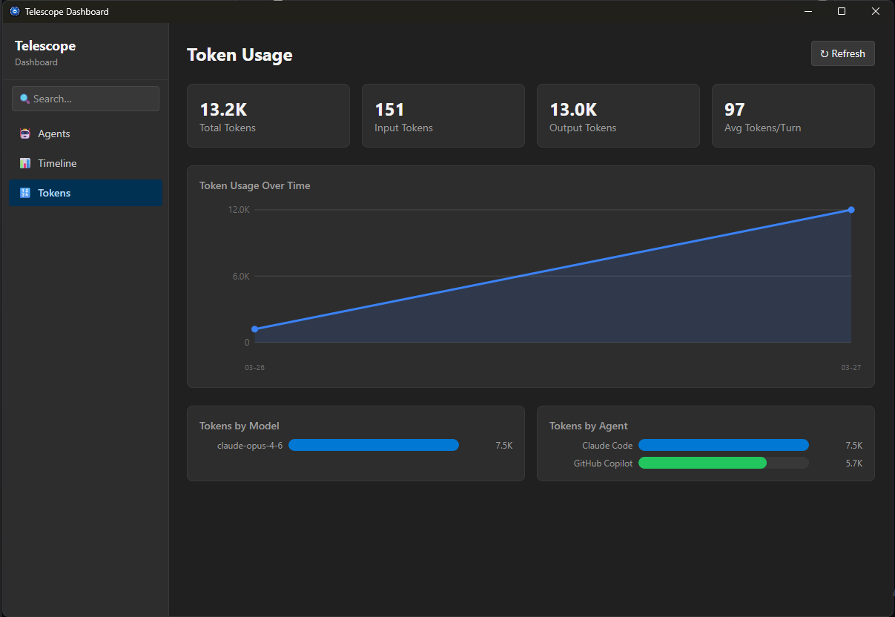

# Project Telescope

**Local-first observability for AI agents. See what your agents are actually doing.**

AI agents are powerful — but opaque. They spawn sub-agents, call tools, read and write files, make network requests, and burn through tokens, all behind the scenes. Project Telescope gives you a window into all of it without sending a single byte off your machine.

This repo contains the **collector plugin system** — the open-source layer that captures telemetry from AI agents like GitHub Copilot, Claude, and any agent with a collector. Write your own collectors for your agents and applications, or use the built-in ones. The Project Telescope service, dashboard, and CLI are available to be installed below.

Read the announcement blog post: [Project Telescope](https://breviu.com/posts/telescope)

---

## What is Project Telescope?

Project Telescope is a local-first observability tool for AI agents and MCPs, giving teams cross agent visibility into what agents did, why they did it, and where they got stuck. 

It works with GitHub Copilot CLI, Claude, and any agent running on your machine with a collector. It requires no changes to your agents or your MCP servers. And **all data stays on your machine** — no cloud, no telemetry leaving your system, no third parties involved.

- **Faster debugging, audit trails, and iteration** — captures tool calls, conversation turns, reasoning and decisions, and friction signals in one place.
- **Background data collectors** — feed a set of local SQLite databases (`~/.telescope/*.db`) with no manual instrumentation required.
- **Privacy-first** — runs entirely on-device with no API keys or cloud dependency.
- **CLI** — `tele watch`, `tele sessions`, `tele insights`, `tele export`, and more, on Windows, macOS, and Linux.
- **Desktop dashboard**  — an app for visual exploration of agent sessions, leaderboards, and execution graphs.

Think "DevTools for your AI pair programmer," purpose-built for local workflows. No config files, no API keys, no cloud accounts. Everything runs locally.

---




## Quickstart

### 1. Install Project Telescope

**Windows**

Download the MSI from the [releases page](https://github.com/microsoft/project-telescope/releases), then install:

```powershell
msiexec /i telescope-windows-x64.msi /quiet
```

This sets up the background service, dashboard, `tele` CLI, and all built-in collectors.

**macOS**

```bash
# Download and extract
tar -xzf telescope-macos-arm64.tar.gz -C ~/.telescope
# Add to PATH
export PATH="$HOME/.telescope:$PATH"
./install.sh
```

**Linux**

```bash
# Download and extract
tar -xzf telescope-linux-arm64.tar.gz -C ~/.telescope
# Add to PATH
export PATH="$HOME/.telescope:$PATH"
sed -i 's/\r$//' install.sh && ./install.sh
```

All platforms install the full stack: the background service, dashboard, `tele` CLI, and all built-in collectors. On macOS and Linux, the install script also registers the service to start automatically via launchd or systemd.

### 2. Verify it's running

```bash
tele doctor
```

### 3. See what your agents are up to

```bash
tele watch        # Live stream of agent activity
tele sessions     # Browse recent sessions
tele insights     # Surface patterns and anomalies
tele dashboard    # Launches the dashboard
```

### 4. (Optional) Build a custom collector

```bash
git clone https://github.com/microsoft/project-telescope.git
cd project-telescope/examples
cargo build --release
tele collector install ./target/release/
tele collector enable my-custom-collector
```

That's it. Your collector is now feeding events into the same pipeline as the built-in ones.

---

## How it works

Project Telescope has two layers: an open-source **collector** layer (this repo) and a **service** layer (installed via the install scripts or MSI).

Collectors are standalone executables that watch AI agents and emit structured events. The service ingests those events, promotes them through a pipeline, and surfaces insights in the dashboard and CLI.

```
  Agent (GitHub Copilot, Claude, etc.)
              │
              │  stdin/stdout, JSONL files
              ▼
  Collector     ← you are here (open-source)
              │
              │  
              ▼
  Project Telescope Service  ← installed via install script / MSI
              │
        ┌─────┴─────┐
        ▼           ▼
   Dashboard       CLI
```

The key design principle: **every collector uses the exact same SDK interface**. There is no privileged native path. A collector you write has identical capabilities to a built-in one.

---

## Built-in collectors

These ship with Project Telescope and serve as reference implementations for building your own.

| Collector         | Type       | What it captures                                      |
| ----------------- | ---------- | ----------------------------------------------------- |
| **MCP Proxy**     | Real-time  | JSON-RPC stdin/stdout interception from any MCP agent |
| **GitHub Copilot JSONL** | File-based | Scans `events.jsonl` session logs                |
| **Claude JSONL**  | File-based | Imports Claude CLI exports                            |
| **Process Scan**  | One-shot   | Discovers AI agent OS processes                       |

---

## Writing your own collector

A collector is a standalone binary that implements the [`Collector`](src/crates/collector-sdk/src/lib.rs) trait and connects to the Telescope service over IPC. The SDK handles pipe connection, registration, batching, backpressure, reconnection, and graceful shutdown — you just implement `manifest()`, `collect()`, and `interval()`.

For a complete step-by-step walkthrough, see the **[Collector Authoring Guide](docs/collector-authoring-guide.md)**. For a working starter template, see the **[Hello World example](examples/hello_world/)**.

---

## Canonical event types

Collectors emit events in a canonical format. The service understands ~40 event variants across these categories:

| Category | Examples |
|----------|---------|
| **Agent** | `AgentDiscovered`, `AgentHeartbeat` |
| **Session** | `SessionStarted`, `SessionEnded`, `SessionResumed` |
| **Turn** | `UserMessage`, `TurnStarted`, `TurnCompleted` |
| **Tool** | `ToolCallStarted`, `ToolCallCompleted` |
| **File** | `FileRead`, `FileWritten`, `FileCreated`, `FileDeleted` |
| **Shell** | `ShellCommandStarted`, `ShellCommandCompleted` |
| **Sub-Agent** | `SubAgentSpawned`, `SubAgentCompleted` |
| **Planning** | `PlanCreated`, `PlanStepCompleted`, `ThinkingBlock` |
| **Context** | `ContextWindowSnapshot`, `ContextPruned` |
| **Human-in-Loop** | `ApprovalRequested`, `ApprovalGranted`, `ApprovalDenied` |
| **Self-Report** | `IntentDeclared`, `DecisionMade`, `FrustrationReported` |
| **Model** | `ModelUsed`, `ModelSwitched` |
| **Error** | `ErrorOccurred`, `RetryAttempted` |
| **Code** | `SearchPerformed`, `CodeChangeApplied` |
| **Network** | `WebRequestMade`, `McpServerConnected` |
| **Cost** | `TokenUsageReported`, `RateLimitHit` |
| **Git** | `GitCommitCreated`, `GitBranchCreated`, `PullRequestCreated` |
| **Catch-all** | `Custom { event_type, data }` |

---

## Privacy and data

Project Telescope is local-first by design.

- **No network egress.** The service never phones home or transmits data externally.
- **All data is user-scoped** — SQLite databases live in your platform's user data directory (`%LOCALAPPDATA%` on Windows, `~/Library/Application Support` on macOS, `~/.local/share` on Linux).

---
## Contributing

We welcome contributions to the collector plugin system. Before submitting a pull request, you'll need to sign the [Microsoft Contributor License Agreement (CLA)](https://cla.opensource.microsoft.com/).

See [`docs/`](docs/) for the collector authoring guide and [`examples/`](examples/) for a starter template.

---

## License

The code in this repository is licensed under the [MIT License](LICENSE).

The Project Telescope service, dashboard, and CLI are distributed as closed-source binaries under Microsoft's standard software license terms, included with the installer.

