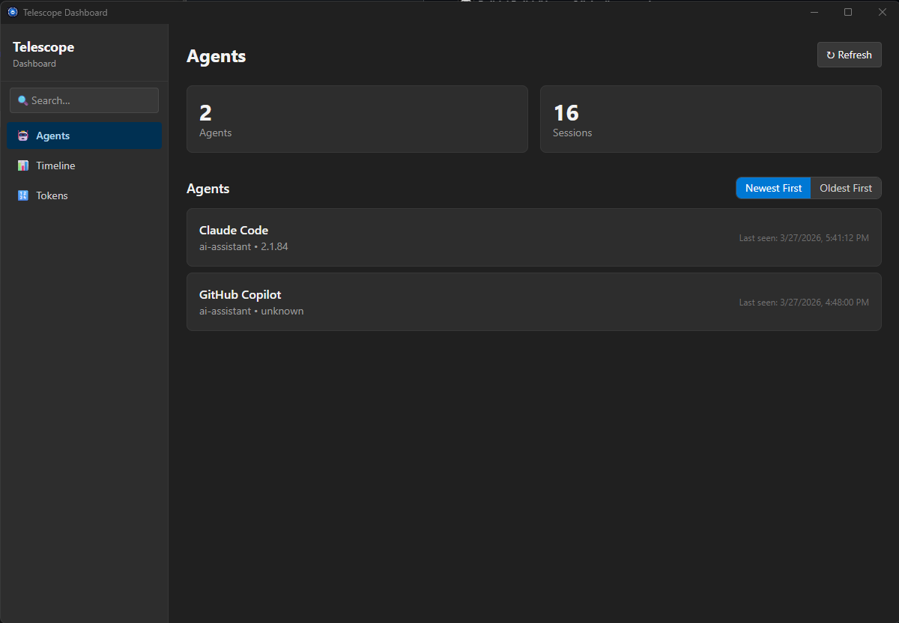

# Project Telescope

**Local-first observability for AI coding agents.**

AI coding agents are powerful — but opaque. They spawn sub-agents, call tools, read and write files, make network requests, and burn through tokens, all behind the scenes. Project Telescope is a local-first observability layer that gives you visibility into what your agents are doing without sending a single byte off your machine.



Read the announcement blog posts: [Project Telescope](https://breviu.com/posts/telescope), [Seeing Machines Think](https://www.ghostpep.site/blog/telescope)

> ⚠️ **Experimental Release** — Project Telescope is in active development. Features, APIs, and data formats may change.

---

## Install

### Windows

Install via [winget](https://learn.microsoft.com/en-us/windows/package-manager/):

```bash
winget install Microsoft.ProjectTelescope
```

Alternatively, download the MSI installer from the [latest release](https://github.com/microsoft/project-telescope/releases).

### macOS and Linux

Binaries for macOS and Linux are available in the [releases](https://github.com/microsoft/project-telescope/releases), but these are not officially supported platforms at this time.

To install, download the release archive and run the install script:

```bash
# Download the archive for your platform
curl -L https://github.com/microsoft/project-telescope/releases/download/v<VERSION>/telescope-<PLATFORM>-v<VERSION>.zip -o telescope.zip
unzip telescope.zip
cd telescope

# Run the install script
./install.sh

# macOS only: Remove quarantine attribute from installed binaries
xattr -d com.apple.quarantine ~/.telescope/bin/tele
```

Replace `<VERSION>` with the latest release version and `<PLATFORM>` with your platform:
- `linux-x86_64`
- `linux-arm64`
- `macos-x86_64`
- `macos-arm64`

Example: `telescope-linux-arm64-v0.6.4.zip`

Check [releases](https://github.com/microsoft/project-telescope/releases) for available archives for your architecture.

**macOS note:** After running the install script, you must remove the quarantine attribute that macOS applies to unsigned downloaded binaries. This is required to run the service on macOS.

**Note:** macOS and Linux builds are provided as-is and may have limited testing compared to the official Windows release.

---

## Stability and expectations

This project is in **early experimental** stage. While core functionality is stable, expect:

- **Data format changes** — event schemas and database formats may evolve between releases without migration tools
- **API instability** — CLI commands and collector APIs may change between releases
- **Breaking changes** — no semantic versioning guarantees until 1.0 release
- **Limited platform testing** — especially on macOS and Linux

Please [open an issue](https://github.com/microsoft/project-telescope/issues) to report bugs or provide feedback.

---

## What you get

- **`tele` CLI** — query agents, sessions, turns, and side-effects from the terminal
- **Dashboard** — a desktop app for exploring agent activity visually
- **Built-in collectors** — Copilot JSONL, Claude Code JSONL, and MCP proxy ship out of the box
- **Collector SDK** — build your own collectors for any AI agent (this repo contains the SDK source)


---

## Using the CLI

```bash
tele setup                         # instrument MCP configs with the proxy
tele status                        # service overview
tele agents list                   # list known agents
tele sessions list                 # list sessions
tele sessions get <session-id>     # session details
tele turns list <session-id>       # list turns in a session
tele collectors list               # list loaded collectors
```

### MCP proxy

Telescope includes an MCP proxy that intercepts JSON-RPC traffic between AI agents and MCP servers. Use `tele setup` to automatically instrument your existing MCP server configs:

```bash
# Instrument all known MCP configs (Copilot, Claude Desktop, Cursor, VS Code)
tele setup

# Undo and restore original configs
tele setup --undo
```

This replaces each MCP server command in your config files with `tele proxy`, which transparently forwards traffic while capturing every tool call, resource read, and prompt. You can also use the proxy directly:

```bash
# Wrap any stdio-based MCP server
tele proxy stdio -- npx @modelcontextprotocol/server-filesystem /path
```

Add `--json` to any command for machine-readable output.

---

## Privacy and data

Project Telescope is **local-first** by design.

- **All data is user-scoped** — SQLite databases live in `~/.telescope`.
- **No API keys, no cloud accounts, no third parties.**

---

## Building collectors

This repository contains the open-source **Collector SDK** — the API for building out-of-process collectors that feed structured telemetry into the Telescope service.

The key design principle: **every collector uses the exact same SDK interface**. There is no privileged native path — a collector you write has identical capabilities to a built-in one.

### Collector SDK

A collector is a standalone binary that implements the [`Collector`](src/crates/collector-sdk/src/lib.rs) trait. The SDK provides two APIs:

- **Rust API** — implement the `Collector` trait and call `run()`. The SDK handles IPC connection, registration, collect loops, batching, backpressure, reconnection, and graceful shutdown.
- **C-ABI** — link against the cdylib and call `telescope_sdk_init` / `telescope_sdk_submit` / `telescope_sdk_shutdown` for non-Rust collectors (C, Python, Go, etc.).

You implement four required methods:

| Method | Purpose |
|--------|---------|
| `manifest()` | Return collector metadata (name, version, description) |
| `agent()` | Declare which agent this collector serves (`AgentConfig`) |
| `collect()` | Gather and return events — called every `interval()` |
| `interval()` | How often to call `collect()` |

### Minimal example

```rust
use telescope_collector_sdk::{AgentConfig, Collector, CollectorManifest, run};
use telescope_collector_sdk::EventKind;
use std::time::Duration;

struct MyCollector;

#[async_trait::async_trait]
impl Collector for MyCollector {
    fn manifest(&self) -> CollectorManifest {
        CollectorManifest {
            name: "my-collector".into(),
            version: "0.1.0".into(),
            description: "My custom collector".into(),
        }
    }

    fn agent(&self) -> AgentConfig {
        AgentConfig {
            agent_id: "my-agent".into(),
            name: "My Agent".into(),
            agent_type: "ai-assistant".into(),
            version: None,
        }
    }

    async fn collect(&mut self) -> anyhow::Result<Vec<EventKind>> {
        Ok(vec![])
    }

    fn interval(&self) -> Duration {
        Duration::from_secs(15)
    }
}

#[tokio::main]
async fn main() -> anyhow::Result<()> {
    run(MyCollector).await
}
```

For a complete step-by-step walkthrough, see the **[Collector Authoring Guide](docs/collector-authoring-guide.md)**. For a working starter template, see the **[Hello World example](examples/hello_world/)**.

### Building the SDK from source

```bash
git clone https://github.com/microsoft/project-telescope.git
cd project-telescope
cargo build --release
```

---

## Built-in collectors

These ship with Telescope and serve as reference implementations for building your own.

| Collector | Type | What it captures |
|-----------|------|------------------|
| **GitHub Copilot JSONL** | File-based | Scans Copilot `events.jsonl` session logs |
| **Claude Code JSONL** | File-based | Imports Claude Code CLI session exports |
| **MCP Proxy** | Live intercept | Wraps MCP servers to capture JSON-RPC traffic in real time |

Source code is in [`src/collectors/`](src/collectors/).

The **Heartbeat** collector in [`src/collectors/heartbeat/`](src/collectors/heartbeat/) is an example/test collector that emits periodic events — useful as a starting point alongside the [Hello World example](examples/hello_world/).

---

## Canonical event types

Collectors emit events using a shared canonical schema. The event types span these categories:

| Category | Examples |
|----------|---------|
| **Agent** | `AgentDiscovered`, `AgentHeartbeat` |
| **Session** | `SessionStarted`, `SessionEnded`, `SessionResumed`, `SessionMetadataUpdated`, `SessionModeChanged` |
| **Turn** | `UserMessage`, `TurnStarted`, `TurnCompleted`, `TurnStreaming` |
| **Tool** | `ToolCallStarted`, `ToolCallCompleted` |
| **File** | `FileRead`, `FileWritten`, `FileCreated`, `FileDeleted` |
| **Shell** | `ShellCommandStarted`, `ShellCommandCompleted` |
| **Sub-Agent** | `SubAgentSpawned`, `SubAgentCompleted` |
| **Planning** | `PlanCreated`, `PlanStepCompleted`, `ThinkingBlock` |
| **Context** | `ContextWindowSnapshot`, `ContextPruned` |
| **Human-in-Loop** | `ApprovalRequested`, `ApprovalGranted`, `ApprovalDenied`, `UserFeedback` |
| **Self-Report** | `IntentDeclared`, `DecisionMade`, `ThoughtLogged`, `FrustrationReported`, `OutcomeReported`, `ObservationLogged`, `ConfidenceAssessed`, `AssumptionMade` |
| **Recipes** | `RecipeFollowed`, `PathNotTaken`, `SkillInvoked` |
| **Model** | `ModelUsed`, `ModelSwitched` |
| **Error** | `ErrorOccurred`, `RetryAttempted` |
| **Code** | `SearchPerformed`, `CodeChangeApplied` |
| **Network** | `WebRequestMade`, `McpServerConnected` |
| **Cost** | `TokenUsageReported`, `RateLimitHit` |
| **Git** | `GitCommitCreated`, `GitBranchCreated`, `PullRequestCreated` |
| **Hooks** | `HookStarted`, `HookCompleted` |
| **Maintenance** | `CompactionStarted`, `CompactionCompleted` |
| **Catch-all** | `Custom { event_type, data }` |

Events are serialized as internally-tagged JSON: `{ "type": "agent_discovered", "agent_id": "...", ... }`. See [`events.rs`](src/crates/collector-types/src/canonical/events.rs) for the full schema.

---

## IPC protocol

Collectors communicate with the Telescope service over **local named pipes** (Windows) or **Unix domain sockets** (macOS/Linux). The protocol is JSON-RPC style:

1. **Connect** — the collector connects to the service's local IPC endpoint.
2. **Register** — sends its `CollectorManifest` and `AgentConfig`.
3. **Collect loop** — the SDK calls your `collect()` method at the configured interval, batches the returned events, and submits them over the pipe.
4. **Shutdown** — on SIGTERM/Ctrl-C the SDK calls your `stop()` hook and disconnects cleanly.

The SDK handles all protocol details — retries with exponential backoff, batching (max 500 events per submit), backpressure compliance, heartbeats, and automatic reconnection.

---

## Platform support

| Feature | Windows | macOS | Linux |
|---------|---------|-------|-------|
| CLI (`tele`) | ✅ | ✅ | ✅ |
| Service | ✅ | ✅ | ✅ |
| Dashboard | ✅ | ✅ | ✅ |
| Collectors | ✅ | ✅ | ✅ |
| IPC | Named pipes | Unix sockets | Unix sockets |

---

## Contributing

This project is provided as-is. We are not currently accepting external contributions via pull requests. If you find a bug or have a feature request, please [open an issue](https://github.com/microsoft/project-telescope/issues).

This project has adopted the [Microsoft Open Source Code of Conduct](https://opensource.microsoft.com/codeofconduct/).

---

## License

The code in this repository is licensed under the [MIT License](LICENSE).

